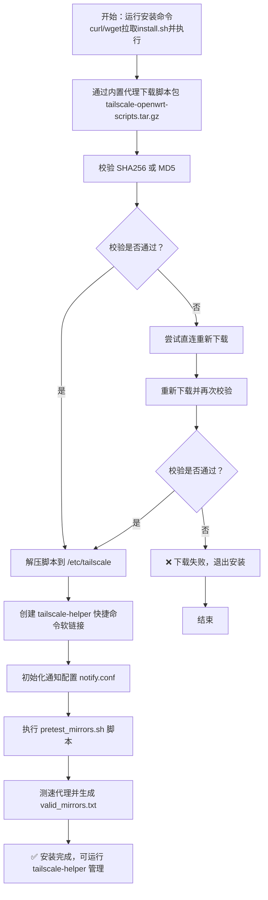

# 小型化 Tailscale 在 OpenWRT 上的一键安装方案

### 脚本目前还有点小bug, 如发现问题请及时反馈~

## 📦 文件结构
```
/etc/tailscale/
├── setup.sh               # 安装脚本
├── fetch_and_install.sh   # 下载脚本
├── test_mirrors.sh        # 代理检测
├── autoupdate.sh          # 自动更新
├── setup_service.sh       # 服务配置
├── setup_cron.sh          # 定时任务
├── notify_ctl.sh          # 通知管理
├── update_ctl.sh          # 更新控制
├── uninstall.sh           # 卸载脚本
├── install.conf           # 安装配置
├── mirrors.txt            # 镜像列表
└── valid_mirrors.txt      # 有效镜像
```

## 🚀 快速安装
### 1.安装必要依赖
   ```bash
   opkg update && opkg install libustream-openssl ca-bundle kmod-tun coreutils-timeout
   ```

### 2.下载管理工具 & 排序代理池
   ```bash
   dtool(){ command -v curl >/dev/null&&echo c||command -v wget >/dev/null&&echo w||exit 1; }
   URL="https://ghproxy.ch3ng.top/https://github.com/CH3NGYZ/small-tailscale-openwrt/raw/refs/heads/main/install.sh"
   [ "$(dtool)" = c ] && curl -fsSL $URL | sh || wget -qO- $URL | sh
   ```

### 3.启动管理工具
   ```bash
   tailscale-helper
   ```



### 🛠️ 管理工具说明
通过   `tailscale-helper` 命令可进入交互式管理界面，提供以下功能：

- 安装/重装 Tailscale - 运行安装脚本
- 启动 Tailscale - 执行 tailscale up 命令
- 管理自动更新 - 配置自动更新设置
- 查看本地版本 - 显示当前安装的 Tailscale 版本
- 检查最新版本 - 获取 Tailscale 最新版本信息
- 管理推送通知 - 配置 Server酱/Bark/NTFY 通知
- 排序代理池 - 测试并排序可用代理
- 更新代理池 - 强制重新检测代理
- 更新脚本包 - 更新管理工具本身
- 卸载 Tailscale - 移除 Tailscale 及相关配置

## 📡 手动编辑代理配置
   注:自定义的代理需要能通过拼接 CH3NGYZ/small-tailscale-openwrt/releases/latest/download/tailscaled_linux_amd64 下载release文件
   1. 编辑镜像列表：
      ```bash
      vi /etc/tailscale/mirrors.txt
      ```
      格式示例：
      ```
      https://wget.la/https://github.com/
      https://ghproxy.net/https://github.com/
      ```
   2. 测试可用性:
      ```bash
      /etc/tailscale/test_mirrors.sh
      ```
## 🔔 通知系统
支持 Server酱、Bark 和 NTFY 通知方式：

配置选项包括：

- 更新通知：版本升级成功/失败时提醒
- 代理失败：检测代理都不可用时提醒

## ⚠️ 注意事项
1. 内存安装模式每次重启后需重新下载 Tailscale
2. 由于代理不稳定，可能出现下载失败，建议使用本地安装模式
3. 首次使用建议配置通知功能
4. 需要至少 curl 或 wget 之一才能正常使用

## 😍 鸣谢
   1. [glinet-tailscale-updater](https://github.com/Admonstrator/glinet-tailscale-updater)
   2. [golang](https://github.com/golang/go)
   3. [UPX](https://github.com/upx/upx)
