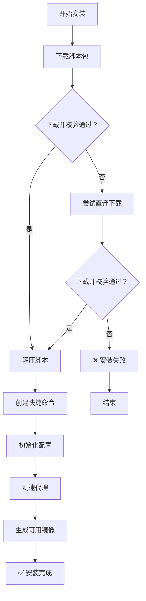

# 小型化 Tailscale 在 OpenWRT 上的一键安装方案
[](https://github.com/CH3NGYZ/small-tailscale-openwrt/releases/latest)
[](https://github.com/CH3NGYZ/small-tailscale-openwrt/releases/latest)
[](https://github.com/CH3NGYZ/small-tailscale-openwrt)
[](https://github.com/CH3NGYZ/small-tailscale-openwrt/stargazers)

### 脚本目前只在ImmortalWRT上测试通过, 其他系统请自测, 可能还有点小bug, 如发现问题请及时反馈~

## 📦 文件结构
```
/etc/tailscale/
├── setup.sh               # 安装脚本
├── fetch_and_install.sh   # 下载脚本
├── test_mirrors.sh        # 代理检测
├── autoupdate.sh          # 自动更新
├── setup_service.sh       # 服务配置
├── setup_cron.sh          # 定时任务
├── notify_ctl.sh          # 通知管理
├── update_ctl.sh          # 更新控制
├── uninstall.sh           # 卸载脚本
├── install.conf           # 安装配置
├── mirrors.txt            # 镜像列表
└── valid_mirrors.txt      # 有效镜像
```

## 🚀 快速安装

### 1.下载管理工具 & 排序代理池
   
   ```bash
   # 请注意, 本脚本内置的 `https://ghproxy.ch3ng.top` 默认block了所有国外ip访问, 您如果您开启了代理, 在运行以下命令时可能会无任何输出, 您可以在clash或其它工具的配置里设置ch3ng.top为直连, 例如clash的配置: `- DOMAIN-SUFFIX,ch3ng.top,DIRECT`, 或使用下方的直连命令
   # 代理版
   rm -rf /etc/tailscale
   dtool(){ command -v curl >/dev/null&&echo c||command -v wget >/dev/null&&echo w||exit 1; }
   URL="https://ghproxy.ch3ng.top/https://github.com/CH3NGYZ/small-tailscale-openwrt/raw/refs/heads/main/install.sh"
   rm -f /tmp/tailscale-use-direct
   [ "$(dtool)" = c ] && curl -fsSL $URL | sh || wget -qO- $URL | sh
   ```
   
   ```bash
   # 直连版
   rm -rf /etc/tailscale
   dtool(){ command -v curl >/dev/null&&echo c||command -v wget >/dev/null&&echo w||exit 1; }
   URL="https://github.com/CH3NGYZ/small-tailscale-openwrt/raw/refs/heads/main/install.sh"
   touch /tmp/tailscale-use-direct
   [ "$(dtool)" = c ] && curl -fsSL $URL | sh || wget -qO- $URL | sh
   ```

### 2.启动管理工具
   ```bash
   tailscale-helper
   ```
### 流程图:



## 🛠️ 管理工具说明

通过 `tailscale-helper` 命令可进入交互式管理界面，提供以下功能：

- 💾 **安装/重装 Tailscale**：运行安装脚本安装或重装 Tailscale
- 📥 **登录 Tailscale**：执行 `tailscale up`，并监听登录 URL 输出
- 📝 **生成启动命令**：交互生成 `tailscale up` 所需参数及命令
- 📤 **登出 Tailscale**：执行 `tailscale logout` 并检查状态
- ❌ **卸载 Tailscale**：清理并卸载 Tailscale
- 🔄 **管理自动更新**：配置本地或临时模式下的自动更新策略
- 📦 **查看本地版本**：查看当前已安装的 Tailscale 版本
- 📦 **查看远程版本**：获取并显示可用的 Tailscale 最新版本
- 🔔 **管理推送通知**：配置 Server酱 / Bark / NTFY 推送
- 📊 **排序代理池**：测试代理可用性并进行排序
- ♻️ **更新代理池**：重新下载并更新代理池列表
- 🛠️ **更新脚本包**：从 GitHub 获取最新版管理脚本并自动更新
- 📜 **查看更新日志**：查看 Tailscale 启动或更新的相关日志
- 🔄 **手动运行更新**：立即执行一次 Tailscale 自动更新脚本

## 📡 手动编辑代理配置
   注:自定义的代理需要能通过拼接 CH3NGYZ/small-tailscale-openwrt/releases/latest/download/tailscaled_linux_amd64 下载release文件
   1. 编辑镜像列表：
      ```bash
      vi /etc/tailscale/mirrors.txt
      ```
      格式示例：
      ```
      https://wget.la/https://github.com/
      https://ghproxy.net/https://github.com/
      ```
   2. 测试可用性:
      ```bash
      /etc/tailscale/test_mirrors.sh
      ```

## 🔔 通知系统
支持 Server酱、Bark 和 NTFY 通知方式：

配置选项包括：

- 更新通知：版本升级成功/失败时提醒
- 代理失败：检测代理都不可用时提醒

## ⚠️  注意事项
1. 内存安装模式每次重启后需重新下载 Tailscale
2. 由于代理不稳定，可能出现下载失败，建议使用本地安装模式
3. 首次使用建议配置通知功能
4. 需要至少 curl 或 wget 之一才能正常使用

## 💬 联系方式

- 如有问题或建议，请提交 issue 或联系仓库作者。

## 😍 鸣谢
   1. [glinet-tailscale-updater](https://github.com/Admonstrator/glinet-tailscale-updater)
   2. [golang](https://github.com/golang/go)
   3. [UPX](https://github.com/upx/upx)
