# **A one-click installation tool for the UPX-compressed, combined version of Tailscale specifically for OpenWRT.**


[](https://github.com/CH3NGYZ/small-tailscale-openwrt/releases/latest)  
[](https://github.com/CH3NGYZ/small-tailscale-openwrt/releases/latest)  
[](https://github.com/CH3NGYZ/small-tailscale-openwrt)  
[](https://github.com/CH3NGYZ/small-tailscale-openwrt/stargazers)

### The script has been tested on ImmortalWRT. For other systems, please test it yourself, as there may be some minor bugs. If you encounter issues, please report them.

## 📦 Repository File Structure
```
├── install.sh                    # Install the script package locally
├── pretest_mirrors.sh             # First-time installation to test proxy pool (only Chinese users need it)
├── mirrors.txt                    # Pre-configured list of proxies
├── tailscale-openwrt-scripts.tar.gz  # Script package from the Scripts directory
└── scripts
    ├── autoupdate.sh              # Auto update script
    ├── fetch_and_install.sh       # Fetch and install script
    ├── github_direct_ctl.sh       # Switch between direct connect or proxy settings (only Chinese users need it)
    ├── helper.sh                  # Helper script
    ├── notify_ctl.sh              # Notification settings script
    ├── setup_cron.sh              # Set up cron tasks script
    ├── setup_service.sh           # Set up service script
    ├── setup.sh                   # Install Tailscale script
    ├── tailscale_up_generater.sh  # Generate Tailscale up command script
    ├── test_mirrors.sh            # Test mirrors script (only Chinese users need it)
    ├── tools.sh                   # Common functions script
    └── uninstall.sh               # Uninstall script
    └── update_ctl.sh              # Auto update configuration script
```

## 🚀 Quick Installation

### 1. Download the management tool
   ```
   rm -rf /etc/tailscale
   dtool(){ command -v curl >/dev/null&&echo c||command -v wget >/dev/null&&echo w||exit 1; }
   URL="https://github.com/CH3NGYZ/small-tailscale-openwrt/raw/refs/heads/main/install.sh"
   touch /tmp/tailscale-use-direct
   [ "$(dtool)" = c ] && curl -fsSL $URL | sh || wget -qO- $URL | sh
   ```

### 2. Launch the management tool
   ```
   tailscale-helper
   ```

### Flowchart:

```mermaid
graph TD
    A[Start Installation] --> B[Download Script Package]
    B --> D{Download and Verify Success?}
    D -->|Yes| E[Extract Script]
    D -->|No| X[❌  Installation Failed]
    
    E --> I[Create Shortcut Commands]
    I --> J[Initialize Configuration]
    J --> K[Run Speed Test for Proxies]
    K --> L[Generate Available Mirrors]
    L --> Y[✅  Installation Complete]
    
    X --> Z[End]
```

<table style="width: 100%;"><tr><td style="width: 50%;"> <details> <summary><strong>Process Flow</strong></summary>
   


</details> </td> <td style="width: 50%;"> <details> <summary><strong>Direct Version Flowchart</strong></summary>
   


</details> </td> </tr> </table>

```mermaid
graph TD
A[Start Installation] --> B[Download Script Package]
B --> D{Download and Verify Success?}
D -->|Yes| E[Extract Script]
D -->|No| X[❌  Installation Failed]

E --> I[Create Shortcut Commands]
I --> J[Initialize Configuration]
J --> Y[✅  Installation Complete]
X --> Z[End]
```

## 🛠️ Management Tool Description

The `tailscale-helper` command enters an interactive management interface, providing the following functions:

1. 💾 **Install/Reinstall Tailscale**: Run the installation script to install or reinstall Tailscale.
2. 📥 **Login to Tailscale**: Execute `tailscale up` and listen for the login URL output.
3. 📝 **Generate Startup Commands**: Interactively generate the necessary parameters and command for `tailscale up`.
4. 📤 **Logout from Tailscale**: Execute `tailscale logout` and check the status.
5. ❌ **Uninstall Tailscale**: Clean up and uninstall Tailscale.
6. 🔄 **Manage Auto-Update**: Configure auto-update strategy for local or temporary mode.
7. 🔄 **Run Update Manually**: Execute the auto-update script immediately.
8. 🔄 **Switch GitHub Direct Connection**: Toggle between using direct connection or proxy. (only Chinese users need it)
9. 📦 **View Local Version**: Check the currently installed Tailscale version.
10. 📦 **View Remote Version**: Fetch and display the available latest Tailscale version.
11. 🔔 **Manage Push Notifications**: Configure Server酱 / Bark / NTFY notifications.
12. 📊 **Sort Proxy Pool**: Test proxy availability and sort. (only Chinese users need it)
13. 🛠️ **Update Script Package**: Get the latest management scripts from GitHub and auto-update.
14. 📜 **View Update Logs**: View logs related to Tailscale startup or update.
15. ⛔ **Exit**: Exit the management tool.


## 🔔 Notification System
Supports Server酱, Bark, and NTFY notification methods:

Configuration options include:

- Update Notifications: Notify on version upgrade success or failure.
- Proxy Failure: Notify when all proxies are unavailable. (**If not a Chinese user, please disable it.**)

## ⚠️ Important Notes
1. Memory installation mode requires re-downloading Tailscale after each reboot.
2. Due to proxy instability, download failures may occur. It is recommended to use local installation mode.
3. It is recommended to configure the notification feature for the first use.
4. At least one of `curl` or `wget` must be available for proper operation.

## 💬 Contact Information

- If you have any issues or suggestions, please submit an issue or contact the repository author.

## 😍 Acknowledgements
1. [glinet-tailscale-updater](https://github.com/Admonstrator/glinet-tailscale-updater)
2. [golang](https://github.com/golang/go)
3. [UPX](https://github.com/upx/upx)
